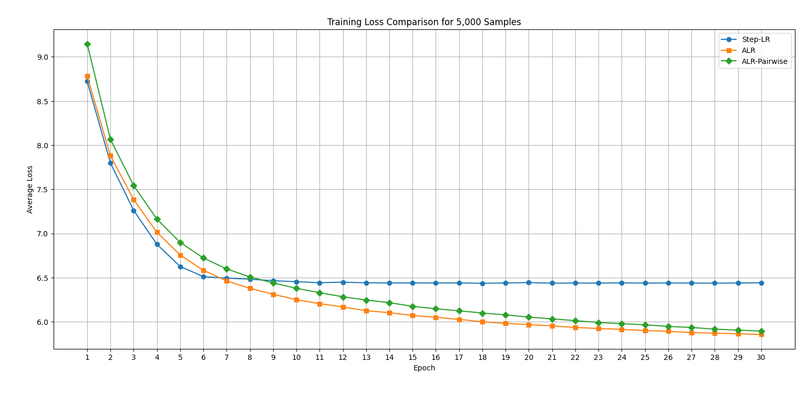

# Layer Dance: Pairwise Layer Training with Adaptive Learning Rates for Transformers

This repository introduces novel training techniques designed to enhance the efficiency and stability of decoder-only transformer models in sequence generation tasks.

## Key Features

- **Adaptive Learning Rate (ALR):**
Dynamically adjusts the learning rate based on gradient and activation norms, promoting stable and efficient convergence.

- **Pairwise Layer Training:**
Only two consecutive layers are trained per batch, with the active pair rotating cyclically across training iterations to ensure balanced layer-wise optimization.

## Adaptive Learning Rate (ALR)

The ALRScheduler automatically adjusts the learning rate during training based on the model’s gradient and activation values. This helps make training more stable and efficient, especially for deep transformer models.

### How It Works

1. **Track moving averages of norms**

    To stabilize learning rate updates, ALR maintains exponential moving averages of the gradient norm (`grad_norm_avg`) and the activation norm (`act_norm_avg`). These averages serve as historical baselines to normalize current norm values:

    ```python
    self.grad_norm_avg = self.norm_smoothing * self.grad_norm_avg + (1 - self.norm_smoothing) * max(grad_norm, 1e-6)
    self.act_norm_avg = self.norm_smoothing * self.act_norm_avg + (1 - self.norm_smoothing) * max(act_norm, 1e-6)
    ```

2. **Normalize current norms**

    Current gradient and activation norms are normalized by dividing by their respective moving averages:

    ```python
    grad_norm_norm = grad_norm / max(self.grad_norm_avg, 1e-6)
    act_norm_norm = act_norm / max(self.act_norm_avg, 1e-6)
    ```

3. **Apply sigmoid scaling**

    The normalized norms are passed through a sigmoid function to bound the values between 0 and 1, smoothing extreme variations:

    ```python
    def sigmoid(self, x):
        return 1.0 / (1.0 + np.exp(-x))
    
    s_g = self.sigmoid(grad_norm_norm)
    s_a = self.sigmoid(act_norm_norm)
    ```

4. **Combine scores and compute learning rate scale**

    A weighted average of the gradient and activation scores produces a combined score:

    ```python
    combined_score = 0.98 * s_g + 0.02 * s_a
    ```

    The learning rate scale is inversely proportional to this combined score, so higher norms reduce the learning rate:

    ```python
    lr_scale = 1.0 / (1.0 + combined_score)
    ```

5. **Calculate and smooth learning rate**

    The raw learning rate is computed by scaling the base learning rate and clamping it within specified min and max bounds:

    ```python
    raw_lr = self.base_lr * lr_scale
    raw_lr = max(self.min_lr, min(self.max_lr, raw_lr))
    ```

    The learning rate update is smoothed to avoid abrupt changes:

    ```python
    self.current_lr = (1 - self.smoothing) *self.current_lr + self.smoothing* raw_lr
    ```

6. **Apply to optimizer**

    Finally, the new learning rate is applied to all parameter groups of the optimizer:

    ```python
    for group in self.optimizer.param_groups:
        group["lr"] = self.current_lr
    ```

### Example Usage in Training Loop

```python
grad_norm = compute_gradient_norm(model) 
act_norm = compute_activation_norm(model)  

alr_scheduler.update_learning_rate(grad_norm, act_norm)
```

This process allows the learning rate to adapt continuously based on training dynamics, promoting stable and efficient learning.

## Pairwise Layer Training

This mechanism enables focused training on two overlapping decoder layers at a time, cycling through the network to promote efficient fine-tuning and reduce memory consumption.

### How It Works

1. **Select only two layers for training**

    The train_next_decoder_pair() method activates gradient updates only for the current pair: current_layer and current_layer + 1. All other decoder layers are frozen.

    ```python
    for i, layer in enumerate(self.model.decoder.layers):
        requires_grad = i == self.current_layer or i == self.current_layer + 1
        for param in layer.parameters():
            param.requires_grad = requires_grad
    ```

    This ensures that just two consecutive layers are trained at a time, allowing precise control over layer updates.

2. **Cycle through layer pairs**

    The switch_pair() method advances the current training pair in a cyclic manner. Once the last valid pair (N-2, N-1) is reached, it wraps around to (0,1), N is the number of layers:

    ```python
    if self.current_layer >= len(self.model.decoder.layers) - 2:
        self.current_layer = 0
    else:
        self.current_layer += 1
    ```

    This creates a schedule like:

    ```txt
    (0,1) → (1,2) → (2,3) → ... → (N-2,N-1) → (0,1)
    ```

### Example Usage in Training Loop

```python
for epoch in range(num_epochs):
    epoch_loss = 0.0
    ...
    self.switch_pair()
```

This process allows for focused optimization with reduced training noise, lower memory usage, and clearer insights into individual layer behavior—making it ideal for efficient and interpretable fine-tuning.

## Training Strategies Compared

- **Standard Step-based Learning Rate (Step-LR)**

- **Adaptive Learning Rate (ALR)**

- **Adaptive Learning Rate with Pairwise Layer Training (ALR-Pairwise)**

Experiments on datasets containing 5,000 and 10,000 samples demonstrate that the ALR-Pairwise approach leads to more stable and efficient training, highlighting the potential of adaptive, selective optimization in deep transformer architectures.

## Experimental Results

- ### Results on 5,000 Samples

    
    **Training Loss Analysis:**</br>
    Among the three methods, ALR-Pairwise demonstrates the most stable and consistent training loss curve, with a smooth and steady decline throughout the training process. In contrast, Step-LR shows an initially sharp drop in loss, followed by increasing fluctuations, indicating instability as the fixed-step schedule fails to align with the model's learning dynamics. ALR offers a middle ground, with a generally steady decrease in loss but occasional irregularities due to simultaneous adaptive updates across all layers.

     
    **Learning Rate Behavior:**</br>
    Step-LR follows a rigid schedule with abrupt drops that ignore the model’s actual learning progress, potentially stalling improvement. ALR, by contrast, adjusts the learning rate more gradually based on the model’s performance, promoting continuous learning. ALR-Pairwise further refines this approach by tailoring adjustments to specific layer pairs, resulting in the most balanced and efficient learning rate transitions without sharp jumps or unnecessary drops.

- ### Results on 10,000 Samples

    
    **Training Loss Analysis:**</br>
    The training loss behavior highlights the differences between the three strategies. With **Step-LR**, the loss initially declines but soon becomes unstable, fluctuating frequently due to the rigidity of fixed learning rate schedules. In contrast, **ALR** shows a more stable loss curve compared to scenarios with fewer samples, though it still exhibits some noise from simultaneous layer updates. The **ALR-Pairwise** method demonstrates the smoothest and most gradual decline in loss, indicating its effectiveness in maintaining consistent learning even with larger training datasets.

    
    **Learning Rate Behavior:**</br>
    The learning rate dynamics further emphasize the advantages of adaptive strategies. **Step-LR** introduces abrupt drops at fixed intervals, which often misalign with the model’s actual learning needs, leading to inefficiencies. **ALR** improves upon this by dynamically adjusting the learning rate based on training behavior, offering better control and progression. The **ALR-Pairwise** approach refines this further, with learning rates changing gradually based on feedback from specific layer pairs, effectively balancing learning speed and stability.

## Installation

Clone the repository:

```sh
git clone https://github.com/aakash-dec7/Adaptive-Learning-Rates.git
cd Adaptive-Learning-Rates
```

### Install Dependencies

```sh
pip install -r requirements.txt
```

### Run the pipeline

```sh
python main.py
```

## Conclusion

The experimental results clearly demonstrate the superiority of adaptive learning rate strategies over fixed-step scheduling in decoder-only model training. Among the methods evaluated, ALR-Pairwise emerged as the most effective approach, achieving the lowest training loss and the smoothest convergence across both the 5,000 and 10,000-sample datasets. Its dynamic learning rate adjustment combined with pairwise layer training allowed the model to adapt more efficiently to the learning dynamics at each stage, leading to more stable and consistent performance throughout training.

In contrast, the Step-LR approach, which employed abrupt learning rate drops at fixed epochs, showed the least favorable results. Its rigid scheduling led to higher training losses and noticeable instability, particularly after the early stages of training. These findings highlight the limitations of fixed learning rate schedules in complex training setups and emphasize the importance of adaptive mechanisms like ALR and ALR-Pairwise for optimizing deep learning performance in resource-constrained or variable data regimes.

## License

This project is licensed under the **MIT License**. See [LICENSE](LICENSE) for details.
